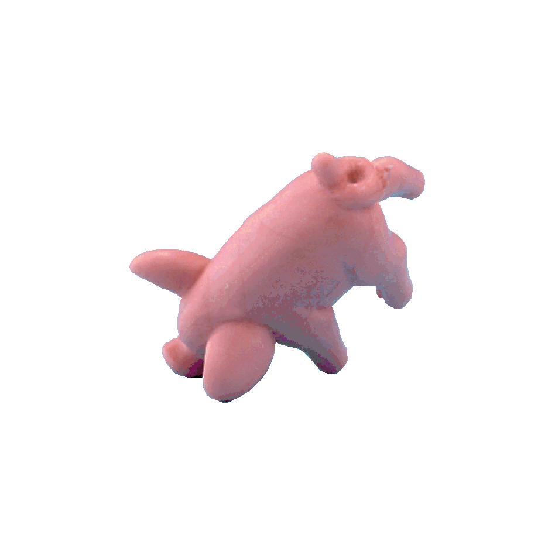

# Pass the pigs 

Welcome to my first web development project! 
[Pass the pigs](https://en.wikipedia.org/wiki/Pass_the_Pigs) is originally a version of a dice game where players sit around a table and throw little plastic pigs instead of dices. I used HTML, CSS and, Javascript to create this digital adaptation inspired by the original game. ***[Start playing now!](https://giuliagalizoni.github.io/passthepigs/)***

## Rules
On each turn, a player rolls the pigs and waits for the result based on which position the pigs will land -- they can gain points, lose points or lose their turn. The active player can roll the pigs as much as they want and gain round points unless they lose their turn, in which case they lose all the round points. Round is over when the active player clicks on "Get the points" and "Pass the pigs" or when the pigs land in a position that makes the player lose their turn. Players only gain the round points when they click on "Get the points". The player who accumulates 100 or more points first wins.

### Positions:
- **Leaning Jowler:** +15 points
- **Snouter:** +10 points
- **Sider:** +1 point
- **Makin' bacon:** player loses all the round points, all the accumulated points, and their turn
- **Razorback:** +5 points
- **Piggyback:** +1 point
- **Pig out:** player loses their turn and all the round points
